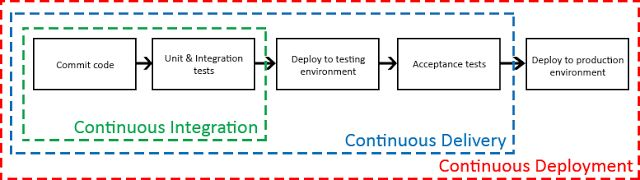
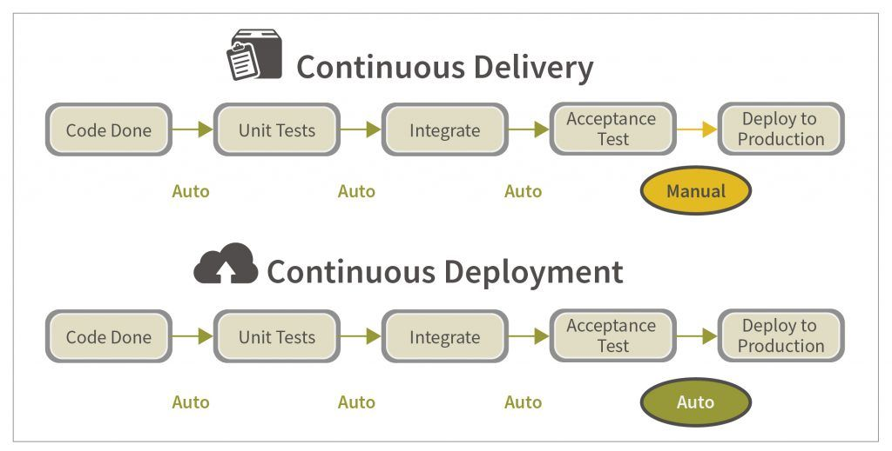
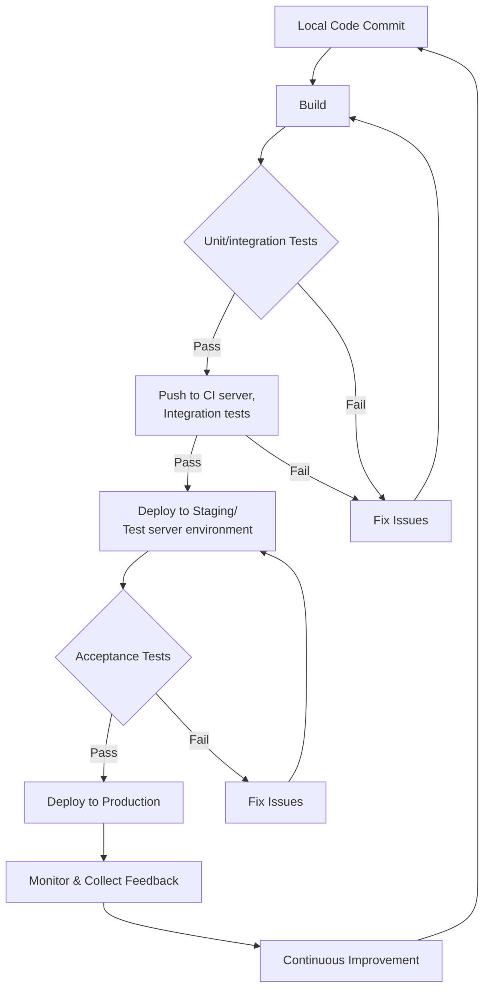

# Introduction to Continuous software development practices

## Continuous workflows

## Continuous Integration (CI)

- A development practice that requires developers to integrate code into a shared repository several times a day
- Each commit is verified by an automated build and tests, allowing teams to detect problems early
- In practice, CI is an automatic build system with unit tests that executes at every commit to version control
  - Build automation produces compiled JavaScript, CSS, and other assets in web development, or binaries (e.g. jar and war files) in other software projects that will be passed to the subsequent stages in the workflow
- Tools required include:
  - CI server, e.g. Github Actions, Gitlab CI, Jenkins, Travis CI, Circle CI, Bamboo, Gump,...
  - Unit and integration test frameworks like: Jest, Mocha, Vitest, JUnit, NUnit, Pytest,...

### Why continuous integration?

- To test automatically and as often as possible (= at every code change) to verify that
  - your changes work
  - your changes work with changes made by other developers
- Development team can continue working on code even while tests are being run (can take long time in large projects)
- To avoid long, difficult and bug-inducing code merges
- Increases confidence in code long before production

## Continuous Delivery (CD)

- Development practices in which teams produce software in short cycles, ensuring that the new features (or changes) can be reliably released to production at any time
  - The deployment to production is triggered manually
- Comprises continuous integration, automated testing, and automated deployment capabilities with minimal human intervention to produce deployable packages
- Tools include:
  - CI tools listed above
  - Acceptance test frameworks and platforms, e.g. Selenium, Sauce Labs
  - Application platforms for deployments: own server, hosted or cloud-based, such as Azure, OpenShift, AWS, Heroku, Google Cloud platform, Azure Web App,...

### Why continuous delivery?

- Allows to release software faster and more frequently
- Reduces the cost, time, and risk of delivering changes by allowing for smaller incremental updates to production
  - Makes going to production a low stress activity
- Enables automated testing throughout the pipeline

## Continuous Deployment (CD)

- Next step past continuous delivery, where you code changes are automatically deployed to production as soon as the release criteria for those changes are met
  - Release criteria may be running some automated tests, code reviews, load tests, manual verification by a QA person or business stakeholder
- Deployment automation
  - A deployment is required every time the application is installed in an environment for testing
  - Most critical moment for deployment automation is rollout to production. Since the preceding stages have verified the overall quality of the system, this is a lowers the risks of this step

### Deployment Pipeline

- A deployment pipeline is a system responsible for (automated) continuous delivery of software
- It deploys code to dev, test and production environments, enforces approval gates, and executes automated tests
- Primary phases:
  1. Developer writes code with new or updated software functionality
  1. **Commit**: updated code (the change) is committed to version control system
  1. Compilation of code provides binaries for later testing and integration stages (if needed)
  1. **Test**: the change undergoes multiple automated tests
  1. **Stage**: the change is deployed to a realistic environment for final testing.
  1. Stage proceeds either automatically (if tests pass) or require human authorization
  1. **Deploy**: the change is deployed to a production environment.

### Workflow from development to production (simplified example)

---

## Assignments

### Reading & examples

Some links to get started with

- [GitHub Actions](https://docs.github.com/en/actions/learn-github-actions/understanding-github-actions) and [one youtube tutorial of many](https://www.youtube.com/watch?v=R8_veQiYBjI)
- [Github Workflows](https://docs.github.com/en/actions/using-workflows/about-workflows)
- [Workflow syntax (YAML)](https://docs.github.com/en/actions/using-workflows/workflow-syntax-for-github-actions)
- [Github Webhooks](https://docs.github.com/en/webhooks)
- [React Native example](https://blog.logrocket.com/react-native-ci-cd-using-github-actions/)
- [Android example](https://www.runway.team/blog/how-to-set-up-a-ci-cd-pipeline-android-app-using-bitrise) and [other example](https://www.runway.team/blog/ci-cd-pipeline-android-app-fastlane-github-actions)
- [iOS example](https://www.runway.team/blog/how-to-set-up-a-ci-cd-pipeline-for-your-ios-app-fastlane-github-actions)

### Task 1 (individual): Continuous Integration with Node.js & GitHub Actions example

Study and do [this Node.js & GitHub actions example](https://github.com/mattpe/node-ci-intro).

### Task 2 (team work): Design and configure Continuous Integration pipeline for your project

1. Implement a functional CI/CD pipeline (on prototype level at least)

    - Use your own project for the implementation, requirements depend on your project type
    - Try to reach at least making automatic build when you push code to your git remote repository. If you use NodeJS for back-end application, try to run (unit) tests and deploy the application automatically.
    - At your convenience, use GitHub (with integrated Actions) or Gitlab (with integrated CI pipelines) or TravisCI (or [any other](https://github.com/marketplace/category/continuous-integration))
    - Once you get the pipeline done, test pushing with working code (and corrupted code too to get a build to fail to see the results).

2. Write a description about your CI/CD pipeline design and implementation including e.g.:

    - How is the current implementation working?
      - If relevant, include a link to e.g. test server where latest version of app is deployed, or to automatically generated artifacts (like apk for Android) where those can be downloaded
    - Key features of the implementation
    - What is still missing?
    - Possible next steps or enhancements in future

3. Submitting the assignment

    - Include a link to your implementation and the written description to your project's Planner/Trello/project board
    - Use your CI/CD pipeline implementation as a part of your project development workflow

Assignment is evaluated as a part of the project work.
